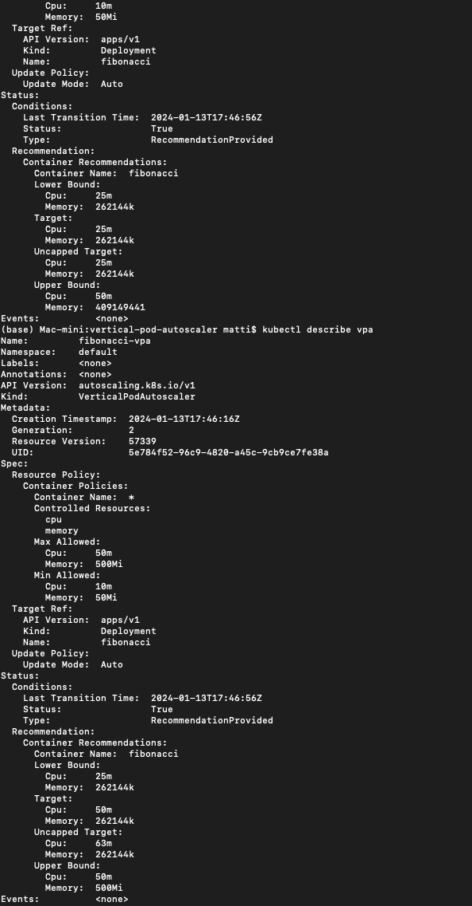
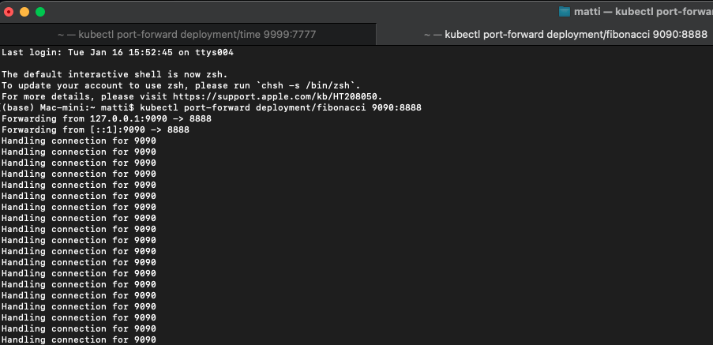
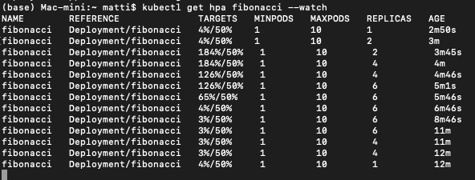
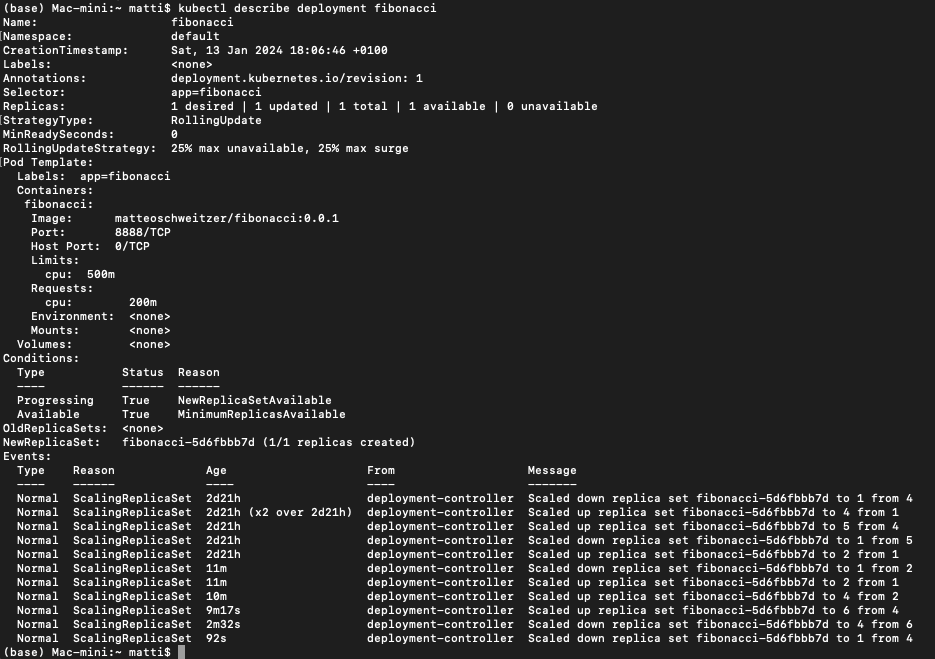

# Cloud Computing Project Group 3

## Team members:
- Maximilian Fink
- Matteo Schweitzer
- Daniel Lovrinovic

## Project proposal
[Proposal](./PROPOSAL.md)

## Tutorial
### Prerequisites

1. [Docker](https://docs.docker.com/get-docker/)

1. Install `kind` by following the installation instructions provided in the [quick start](https://kind.sigs.k8s.io/docs/user/quick-start/)

#### Creating a local Cluster

1. In your terminal, execute the following command:

   ```console
   kind create cluster
   ```

### minikube

`minikube` minikube is local Kubernetes, focusing on making it easy to learn and develop for Kubernetes.

#### Starting a local Cluster

1. In your terminal, execute the following command:

   ```console
   minikube start
   ```

#### STARTING MICROSERIVES

### Requirements

- `kubectl` is connected to the Kubernetes cluster created

```console
   minikube addons enable metrics-server
```


### Start microservices
Open terminal and run:

```console
   kubectl apply -f <path_to_microservices.yaml>
```

### Time microservice

1. To forward your local port **9999** to the container port **7777**, use:

   ```console
   kubectl port-forward deployment/time 9999:7777
   ```

   :mag: Now, access the website [http://localhost:9999](http://localhost:9999).

### Fibonacci microservice

1. To forward your local port **9090** to the container port **8888**, use:

   ```console
   kubectl port-forward deployment/fibonacci 9090:8888
   ```

   :mag: Now, access the website [http://localhost:9090](http://localhost:9090).

### Factorial microservice

1. To forward your local port **9000** to the container port **5555**, use:

   ```console
   kubectl port-forward deployment/factorial 9000:5555
   ```

   :mag: Now, access the website [http://localhost:9000](http://localhost:9000).

### prime microservice

1. To forward your local port **9990** to the container port **6666**, use:

   ```console
   kubectl port-forward deployment/prime 9990:6666
   ```

   :mag: Now, access the website [http://localhost:9990](http://localhost:9990).


#### STARTING VERTICAL AUTOSCALER

1. Run following commands in order and an integrated terminal of vertical-autoscaler.yaml

   ```console
   git clone https://github.com/kubernetes/autoscaler.git
   ```

   ```console
   cd autoscaler/vertical-pod-autoscaler/
   ```

   ```console
   ./hack/vpa-up.sh
   ```

   ```console
   
   kubectl apply -f https://raw.githubusercontent.com/kubernetes/autoscaler/vpa-release-1.0/vertical-pod-autoscaler/deploy/vpa-rbac.yaml

   kubectl apply -f https://raw.githubusercontent.com/kubernetes/autoscaler/vpa-release-1.0/vertical-pod-autoscaler/deploy/vpa-v1-crd-gen.yaml

   kubectl apply -f <path_to_vpa.yaml>
   ```

1. to check if the autoscaler is running, run:

   ```console
   kubectl get pods -n kube-system
   ```

1. to stop the autoscaler, run:

   ```console
   ./hack/vpa-down.sh
   ```

#### Output of the vertical pod autoscaler:
This screenshot shows how the cpu load changes by the time the vpa has to handle a big amount of load.




#### STARTING HORIZONTAL AUTOSCALER

1. Run following commands in order and an integrated terminal of vertical-autoscaler.yaml

   ```console
   kubectl autoscale deployment <name> --cpu-percent=50 --min=1 --max=10
   ```
   or
   ```console
   kubectl apply -f <path_to_hpa.yaml>
   ```

1. to check if the autoscaler is running, run:

   ```console
   kubectl get hpa
   ```
1. to see the load, run:

   ```console
   kubectl get hpa <name> --watch
   ```

1. to stop the autoscaler, run:

   ```console
   kubectl delete hpa <name>
   ```

#### Output of setting up the connection:


   

#### Output of the pod load:
Here you can see pretty good how the horizontal pod autoscaler handles too much load and generates automatically more pods to reduce the load.




#### Output of the pod scaling:




#### LOAD-TESTER

1. K6 load-tester is used for load-generating:

```console
k6 run <path_to_respective_test>
```
